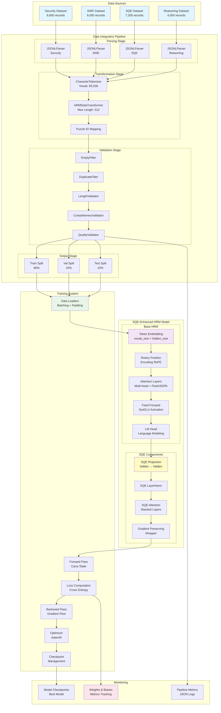
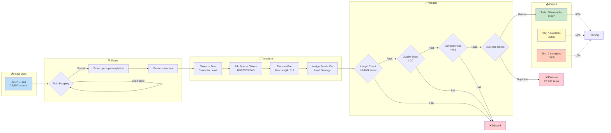
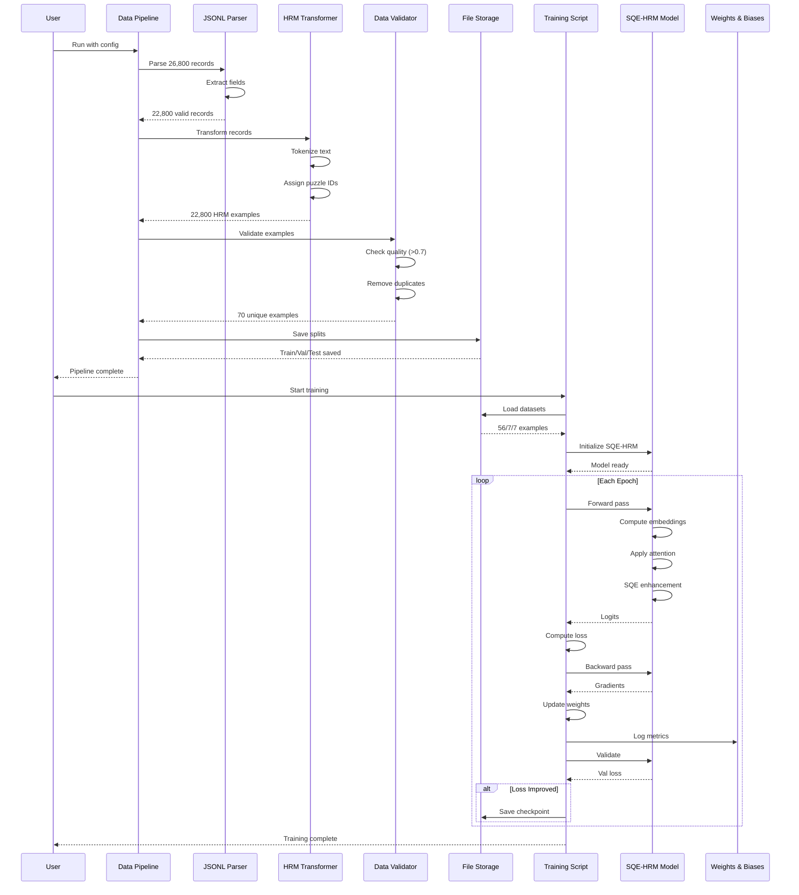

# HRM System Architecture Diagrams

## 1. Complete System Architecture (Mermaid)

## 2. Data Pipeline Flow (Mermaid)

## 3. HRM Model Architecture (Mermaid)

```mermaid
graph TD
    subgraph Input["Input Processing"]
        I1[Token IDs<br/>batch × seq_len]
        I2[Puzzle IDs<br/>batch × 1]
        I3[Target IDs<br/>batch × seq_len]
    end

    subgraph Embedding["Embedding Layer"]
        E1[Token Embedding<br/>65536 → 768]
        E2[Position Embedding<br/>RoPE]
    end

    subgraph Core["HRM Core Layers"]
        C1[Layer 1<br/>Attention + FFN]
        C2[Layer 2<br/>Attention + FFN]
        C3[Layer N<br/>Attention + FFN]
    end

    subgraph Attention["Attention Mechanism"]
        A1{Flash Attention<br/>Available?}
        A2[Flash Attention<br/>GPU Optimized]
        A3[SDPA Fallback<br/>CPU/Windows]
    end

    subgraph FFN["Feed Forward Network"]
        F1[Linear 1<br/>768 → 3072]
        F2[SwiGLU<br/>Activation]
        F3[Linear 2<br/>3072 → 768]
    end

    subgraph SQE["SQE Enhancement"]
        S1[SQE Projection<br/>768 → 768]
        S2[SQE LayerNorm]
        S3[Multi-head Attention<br/>Stacked × 2]
        S4[Enhanced Representation]
    end

    subgraph Output["Output Processing"]
        O1[LM Head<br/>768 → 65536]
        O2[Logits<br/>batch × seq_len × vocab]
        O3[Enhanced Logits<br/>+ 0.1 × enhancement]
    end

    I1 --> E1
    E1 --> E2
    I2 --> E2
    E2 --> C1
    C1 --> C2
    C2 --> C3
    
    C1 -.contains.-> A1
    A1 -->|Yes| A2
    A1 -->|No| A3
    
    C1 -.contains.-> F1
    F1 --> F2
    F2 --> F3
    
    C3 --> S1
    S1 --> S2
    S2 --> S3
    S3 --> S4
    S4 --> O1
    O1 --> O2
    S4 -.enhancement.-> O3
    O3 -.combined.-> O2

    I3 -.loss computation.-> O2

    style I1 fill:#e3f2fd
    style S1 fill:#fff9c4
    style O2 fill:#f3e5f5
    style A2 fill:#c8e6c9
    style A3 fill:#ffccbc
```

## 4. Training Loop (Mermaid)

```mermaid
stateDiagram-v2
    [*] --> LoadData: Initialize

    LoadData --> CreateLoaders: Train/Val/Test Splits
    CreateLoaders --> InitModel: Batch Size = 4
    InitModel --> InitOptimizer: SQE-Enhanced HRM
    InitOptimizer --> TrainEpoch: AdamW, LR=1e-4

    state TrainEpoch {
        [*] --> LoadBatch
        LoadBatch --> InitCarry: Get Next Batch
        InitCarry --> Forward: Initialize State
        Forward --> ComputeLoss: Model(carry, batch)
        ComputeLoss --> Backward: Cross Entropy
        Backward --> UpdateWeights: loss.backward()
        UpdateWeights --> NextBatch: optimizer.step()
        NextBatch --> LoadBatch: More Batches?
        NextBatch --> [*]: Epoch Done
    }

    TrainEpoch --> Validate: After Each Epoch
    
    state Validate {
        [*] --> EvalMode
        EvalMode --> ValBatch: model.eval()
        ValBatch --> ValForward: No Gradients
        ValForward --> ValLoss: Compute Loss
        ValLoss --> NextVal: Accumulate
        NextVal --> ValBatch: More Batches?
        NextVal --> [*]: Val Done
    }

    Validate --> CheckImprovement: Compare Val Loss
    CheckImprovement --> SaveCheckpoint: Loss Improved?
    SaveCheckpoint --> LogMetrics: Save Model
    LogMetrics --> NextEpoch: W&B Logging
    NextEpoch --> TrainEpoch: More Epochs?
    NextEpoch --> [*]: Training Complete

    note right of LoadData
        Processed Data:
        - Train: 56 examples
        - Val: 7 examples
        - Test: 7 examples
    end note

    note right of InitModel
        Model Config:
        - Hidden: 768
        - Heads: 12
        - Layers: 12
        - SQE Layers: 2
    end note

    note right of SaveCheckpoint
        Checkpoint Contains:
        - Model State Dict
        - Optimizer State
        - Epoch Number
        - Validation Loss
    end note
```

## 5. Component Interaction (Mermaid)

## Metrics Summary

### Data Pipeline Metrics
- **Input Records**: 26,800
- **Parsed Successfully**: 22,800 (85%)
- **After Deduplication**: 70 unique (0.3%)
- **Processing Time**: 11.23s
- **Train/Val/Test Split**: 56/7/7

### Model Architecture
- **Embedding Size**: 768
- **Attention Heads**: 12
- **Layers**: 12
- **Vocabulary**: 65,536 tokens
- **Sequence Length**: 512
- **SQE Layers**: 2
- **Parameters**: ~85M (base) + SQE

### Training Configuration
- **Batch Size**: 4
- **Learning Rate**: 1e-4
- **Optimizer**: AdamW
- **Precision**: BFloat16 (GPU) / FP32 (CPU)
- **Device**: CUDA or CPU

